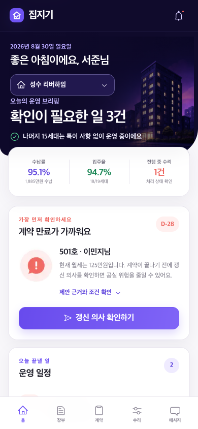
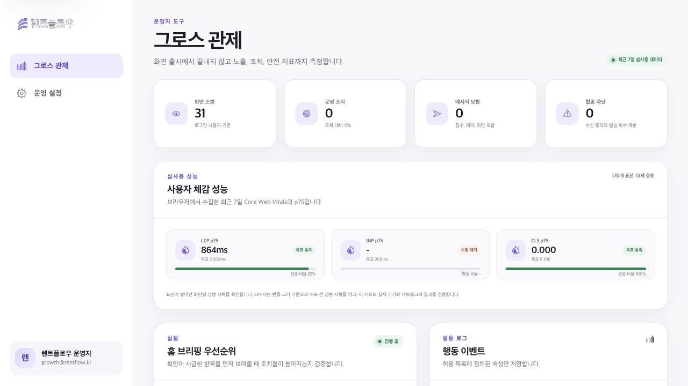

# RentFlow | 임대 운영 그로스 포트폴리오

RentFlow는 1~20개 호실을 직접 관리하는 임대인이 오늘 처리할 일을 놓치지 않도록 돕는 모바일 중심 임대 운영 서비스입니다. 계약 만료, 월세 수납, 민원 대응을 한곳에 모으고, 행동 로그와 A/B 테스트를 제품 구조에 포함해 개선 결과를 측정할 수 있게 만들었습니다.

자리톡과 같은 임대 관리 도메인을 다루되 브랜드, 정보 구조, 문구, 화면은 독립적으로 설계했습니다. 화면 시안에 머물지 않고 인증, 권한, 데이터 저장, API, 실험 배정, 이벤트 검증, 관제, 테스트와 배포까지 연결한 포트폴리오 프로젝트입니다.

**라이브 데모:** [rentflow-khyun.vercel.app](https://rentflow-khyun.vercel.app)

`main` 브랜치의 변경 사항은 GitHub Actions 검증과 Vercel 프로덕션 배포로 이어집니다.

## 데모 계정

| 역할 | 이메일 | 비밀번호 | 확인할 수 있는 경험 |
| --- | --- | --- | --- |
| 임대인 | `demo@rentflow.kr` | `demo1234!` | 오늘의 브리핑, 임대 장부, 갱신 연락, 민원 관리 |
| 그로스 운영자 | `growth@rentflow.kr` | `demo1234!` | 실험 현황, 퍼널과 가드레일 지표, 성능 관제 |

두 역할의 메뉴와 API 접근 권한은 분리되어 있습니다.

## 제품 화면

| 임대인 홈 | 그로스 관제 |
| --- | --- |
|  |  |

## 해결하려는 문제

소규모 임대인은 계약, 입금, 민원을 서로 다른 메신저와 문서에서 관리하는 경우가 많습니다. 그 결과 중요한 후속 조치가 사람의 기억에 의존하고, 어떤 안내가 실제 행동으로 이어졌는지 측정하기도 어렵습니다.

RentFlow는 이 문제를 세 가지 원칙으로 풀었습니다.

1. 홈에서 우선순위와 근거를 함께 보여줍니다.
2. 확인, 연락, 상태 변경을 하나의 흐름으로 연결합니다.
3. 기능을 출시하는 단계에서 실험과 이벤트 측정까지 함께 설계합니다.

## 구현한 핵심 흐름

### 계약과 수납

- 계약 만료 위험을 우선순위로 정렬하고 판단 근거를 함께 제공합니다.
- 갱신 의사 확인, 응답 저장, 후속 상태 변경을 한 흐름으로 연결했습니다.
- 입금 확인과 미납 안내 이후 최신 상태로 수납률을 다시 계산합니다.

### CRM과 민원

- 연락 동의, 발송 빈도, 야간 예약, 중복 요청 방지를 서버에서 검증합니다.
- 누수 요청의 접수, 일정 조율, 완료 상태를 관리할 수 있습니다.
- 외부 알림톡은 실제 계약 전에도 흐름을 검증할 수 있도록 샌드박스 공급자로 분리했습니다.

### 그로스 실험과 관측성

- 사용자가 어느 실험군에 배정됐는지와 실제 화면 노출을 구분해 기록합니다.
- 허용 목록 기반 이벤트 스키마로 개인정보가 분석 로그에 섞이지 않도록 막았습니다.
- 전환 지표뿐 아니라 수신 해제율 같은 가드레일을 함께 확인할 수 있습니다.
- 실제 브라우저의 Core Web Vitals를 수집하고 최근 7일 p75를 관제합니다.

### 유입과 운영 안전성

- 지역별 검색 랜딩, 메타데이터, 구조화 데이터, 사이트맵을 제공합니다.
- 서명 쿠키와 리소스 소유권 재검증으로 접근을 보호하고, HMAC 웹훅과 감사 로그로 변경 이력을 남깁니다.
- Redis 기반 분산 요청 제한을 지원하며 로컬 개발에서는 인메모리 방식으로 대체합니다.

## 포지션 요구 역량과 구현 근거

| 역량 | 저장소에서 확인할 수 있는 근거 |
| --- | --- |
| React, TypeScript | React 19와 TypeScript로 작성한 반응형 화면, 도메인 타입과 UI 상태 분리 |
| Next.js | App Router, Server Component, Route Handler, 정적 SEO 경로와 메타데이터 |
| 상태와 서버 데이터 관리 | Jotai 기반 클라이언트 상태, TanStack Query 기반 서버 상태 동기화 |
| A/B 테스트 | 결정적 사용자 배정, 배정과 노출 이벤트 분리, 전환과 가드레일 관제 |
| 행동 로그 | Zod 스키마, 이벤트 허용 목록, 중복 방지 키, 운영자 전용 조회 화면 |
| 사용자 경험 | 모바일 우선 정보 구조, 키보드 포커스, 빈 상태와 오류 상태, 접근성 검사 |
| 공통 라이브러리 | 도메인, 분석, 실험, UI를 독립 워크스페이스 패키지로 구성 |
| 품질과 협업 | 명세 문서, 실험 문서, 이벤트 택소노미, CI 품질 게이트와 회귀 테스트 |
| AI 활용 | 요구사항 분해와 반복 검토에 AI를 활용하고 테스트와 수동 QA로 결과를 검증 |

실험 결과를 과장하지 않기 위해 실제 사용자 데이터가 없는 지표는 성과로 표기하지 않았습니다. 이 저장소는 실험을 설계하고 측정 가능한 상태로 구현하는 역량을 보여주는 데 초점을 둡니다.

## 기술 구성

```text
Browser
  └─ Next.js App Router
      ├─ Server Components / Route Handlers
      ├─ TanStack Query / Jotai
      ├─ Domain, Analytics, Experiments, UI packages
      └─ Drizzle ORM / SQLite
          ├─ Local demo data
          └─ Sandbox notification provider
```

| 영역 | 기술 |
| --- | --- |
| 프론트엔드 | Next.js 16, React 19, TypeScript, TanStack Query, Jotai |
| 서버 | Next.js Route Handler, Server Component, Zod, Drizzle ORM |
| 데이터 | SQLite, Redis 요청 제한 선택 지원 |
| 모노레포 | pnpm workspace, Turborepo |
| 테스트 | Vitest, Testing Library, Playwright, axe-core |
| 운영 | GitHub Actions, Vercel, 구조화 로그, Core Web Vitals |

웹 앱과 API를 한 Next.js 프로젝트에서 운영하는 모듈형 모놀리스 구조입니다. 초기 제품의 배포 속도와 타입 공유를 우선하되 도메인, 분석, 실험, UI를 패키지로 분리해 이후 서비스 경계를 나눌 수 있게 했습니다. 자세한 판단 근거는 [프로덕션 아키텍처](docs/ARCHITECTURE.md)에 정리했습니다.

## 검증한 품질 기준

- 웹 단위 및 통합 테스트: 10개 파일, 20개 테스트 통과
- 모바일 핵심 흐름: Playwright 10개 시나리오 통과
- 정적 랜딩: 4개 시나리오 통과
- TypeScript 타입 검사와 Next.js 프로덕션 빌드 통과
- 주요 화면 gzip 번들 예산 통과
- GitHub Actions에서 프로덕션 앱과 보호된 프로토타입을 독립적으로 검증

현재 결과는 로컬과 CI에서 재현할 수 있습니다.

```bash
pnpm verify
```

## 로컬 실행

Node.js 22 이상과 pnpm 10.29.2를 사용합니다.

```bash
corepack enable
pnpm install
pnpm db:reset
pnpm dev
```

`http://localhost:3108`에서 프로덕션 앱을 열 수 있습니다.

초기 모바일 디자인 시안은 별도의 보호된 Vite 런타임으로 유지합니다.

```bash
cd prototype
npm ci
npm run test:runtime:setup
npm run dev -- --host 0.0.0.0 --port 4173 --strictPort
```

포트폴리오 설명용 실험 전환 패널과 이벤트 로그는 기본 사용자 화면에서 숨겼습니다. 모바일 시안 주소에 `?portfolio=1`을 붙이면 확인할 수 있으며, 상호작용 회귀 검사는 `npm run test:runtime`으로 실행합니다.

## 운영 전환 경계

이 프로젝트는 프로덕션 구조와 배포 흐름을 검증한 포트폴리오 데모입니다.
외부 알림톡과 금융 데이터는 실제 공급자 계약 대신 샌드박스를 사용하며, Vercel 데모 데이터는 영구 보관을 전제로 하지 않습니다.
실서비스 전환 시에는 관리형 PostgreSQL, 영속 큐, 실제 CRM 공급자, 비밀 값 관리와 장애 알림을 연결해야 합니다.

남은 운영 전환 항목과 완료 조건은 [프로덕션 준비 상태](docs/PRODUCTION-READINESS.md)에서 확인할 수 있습니다.

## 문서

- [제품 요구사항](docs/PRD.md)
- [프로덕션 아키텍처](docs/ARCHITECTURE.md)
- [실험 설계](docs/EXPERIMENTS.md)
- [이벤트 택소노미](docs/EVENTS.md)
- [채용 요건 대응표](docs/REQUIREMENT-MATRIX.md)
- [전달 계획과 완료 조건](docs/DELIVERY-PLAN.md)
- [디자인 시스템](docs/DESIGN-SYSTEM.md)
- [AI 활용과 검증 원칙](docs/AI-WORKFLOW.md)
- [React 및 Next.js 코드 리뷰](docs/REACT-NEXT-REVIEW.md)
- [성능 관측성과 품질 예산](docs/OBSERVABILITY.md)
- [로컬 및 운영 런북](docs/RUNBOOK.md)
- [프로덕션 디자인 QA](design-qa.md)
- [보호된 모바일 시안 디자인 QA](prototype/design-qa.md)

## 저장소 구조

```text
.
├── apps/web/             # Next.js App Router 웹앱과 API
├── packages/             # 도메인, 분석, 실험, UI 공통 패키지
├── prototype/            # 선택 디자인을 보존한 모바일 프로토타입
├── docs/                 # 제품, 실험, 아키텍처와 운영 문서
├── Dockerfile            # Next.js standalone 컨테이너
└── .github/workflows/    # 앱과 프로토타입 품질 게이트
```
