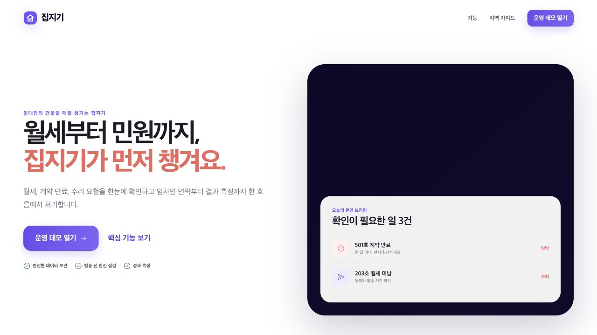
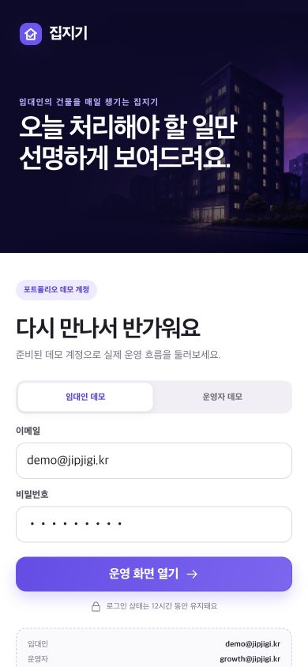
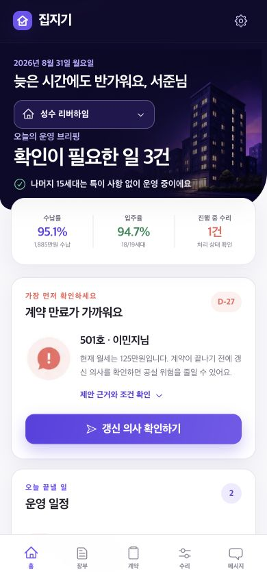
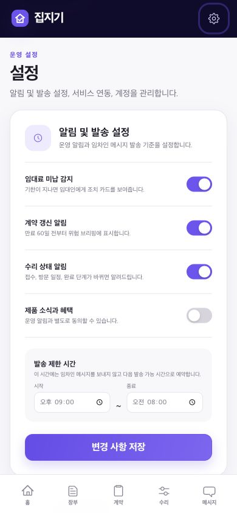
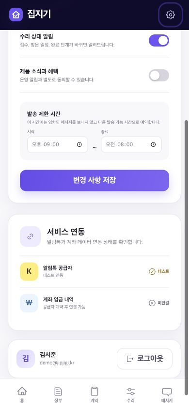
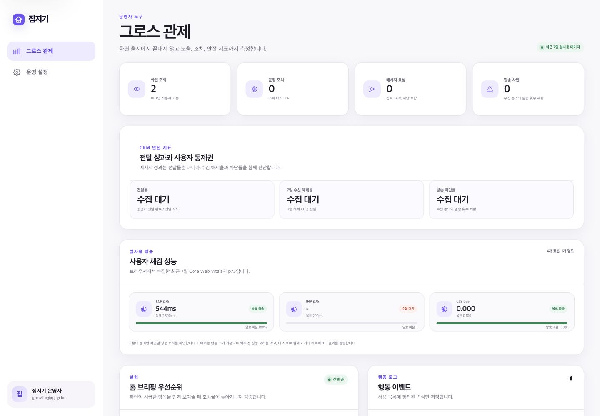

# 집지기 P0·P1 제품 감사와 개선 결과

검토일: 2026년 8월 31일
범위: 공개 랜딩, 데모 로그인, 임대인 모바일 홈과 설정, 운영자 그로스 관제, 세션 권한, 운영 데이터 저장소와 요청 제한

## 결론

P0 문제는 발견되지 않았습니다. P1 문제 3건을 확인했고 모두 코드와 테스트에 반영했습니다.

| ID | 발견 사항 | 영향 | 개선 결과 | 검증 |
| --- | --- | --- | --- | --- |
| P1-01 | 임대인 모바일 화면에서 설정과 로그아웃으로 이동하는 경로가 보이지 않음 | 공유 기기에서 세션을 종료하거나 알림 정책을 바꾸기 어려움 | 모바일 헤더의 알림 아이콘을 이름이 명확한 설정 링크로 교체 | `app-shell.test.tsx`, 모바일 홈과 계정 화면 캡처 |
| P1-02 | API 세션이 최대 12시간 동안 JWT의 역할을 그대로 신뢰함 | 역할이 회수된 뒤에도 기존 권한이 남을 수 있음 | 요청마다 사용자 존재 여부와 현재 역할을 DB에서 재조회 | `dal.test.ts`의 역할 변경과 사용자 삭제 시나리오 |
| P1-03 | 운영 영속 데이터와 요청 제한이 단일 인스턴스 저장소에 의존함 | 재배포 시 데이터 유실과 인스턴스별 제한 우회 가능 | 운영은 Neon Postgres와 Upstash Redis를 사용하고, 누락이나 장애 시 상태 확인과 제한 대상 요청을 실패 처리 | PGlite 통합 테스트, Redis 실패 차단 테스트, `/api/health` |

## 흐름별 증거

### 1. 공개 랜딩 — 양호

서비스 대상, 해결하는 문제와 데모 진입점이 첫 화면에서 구분됩니다. 브랜드와 주요 CTA의 대비도 충분합니다.

### 2. 데모 로그인 — 양호

임대인과 운영자 역할을 분리하고 입력 이름, 상태 안내와 데모 정보를 제공합니다. 실제 서비스에서는 공개 데모 자격 증명 대신 인증 공급자, 비밀번호 재설정과 MFA가 필요합니다.

### 3. 임대인 모바일 홈 — P1-01 개선 완료

모바일 헤더 오른쪽에 설정 아이콘을 고정하고 접근 가능한 이름을 `설정 및 계정 열기`로 지정했습니다. 핵심 업무 메뉴는 하단 내비게이션에 유지했습니다.

### 4. 설정과 계정 — P1-01 개선 완료

알림 정책, 발송 제한 시간, 연동 상태와 로그아웃이 한 흐름에 연결됩니다. 390×844 화면에서 고정 하단 메뉴가 계정 조작을 가리지 않는지 확인했습니다.

### 5. 그로스 관제 — 양호

화면 조회와 운영 조치, CRM 가드레일, Core Web Vitals, 실험 노출을 한 화면에서 구분합니다. 데모 표본은 실제 사업 성과가 아니므로 `수집 대기`와 표본 수를 함께 표시합니다.

## 접근성 검토 범위

스크린샷으로 구조, 대비 위험, 반응형 재배치와 터치 대상의 가시성을 확인했습니다. DOM 스냅샷으로 랜드마크, 제목, 링크와 스위치의 접근 가능한 이름을 확인했고 주요 컴포넌트는 axe-core 자동 검사를 통과했습니다. 스크린 리더별 발화, 200% 확대, 고대비 모드와 실제 모바일 보조 기술은 별도 수동 검증이 필요합니다.

## 실행 검증

- 웹 테스트: 13개 파일, 31개 통과
- 추가 회귀: 모바일 설정 진입, 역할 변경, 사용자 삭제, 운영 Redis 누락 시 차단
- TypeScript 검사와 Next.js 프로덕션 빌드 통과
- FigJam 보드: [집지기 P0·P1 제품 감사 및 개선 결과](https://www.figma.com/board/BmSg4yaCfvfhYCPecrWio9)

## 배포 검증과 무료 운영 조건

- 최종 Preview의 전체 품질 게이트 통과: 웹 테스트 31개, 타입 검사, Next.js 빌드와 경로별 번들 예산
- `/api/health`: `status: ok`, `databaseStore: neon`, `rateLimitStore: redis`, `rateLimitReady: true`
- Vercel 함수와 두 저장소 리전: `sin1`
- 계정과 실제 리소스 조회: Vercel Hobby, Neon Free (`free_v3`), Upstash Free (`free`)
- Redis 자동 유료 전환 비활성화: `autoUpgrade=false`, `prodPack=false`
- 공개 데모는 가상 데이터만 사용하며 무료 한도 초과 시 중단을 허용합니다. 유료 인증, 알림톡, 결제 공급자는 연결하지 않았습니다.
- Preview 브라우저에서 임대인 로그인, Neon 데이터 기반 홈과 설정 화면을 확인했습니다. 공유 데모 설정 저장은 외부 데이터 변경에 대한 승인 검토에서 차단되어 실행하지 않았으며, 저장 동작의 근거는 로컬 통합 테스트입니다.

FigJam에는 스크린샷과 P1별 개선 메모가 연결되어 있습니다. 다만 무료 Starter 플랜의 MCP 호출 한도를 소진해 P1-03 메모의 외부 리소스 연결 대기 문구를 갱신하지 못했습니다. **연결은 완료됐으며 최신 실행 상태는 이 문서를 기준으로 확인합니다.** 보드를 수정하기 위해 유료 플랜으로 전환하지 않았습니다.
