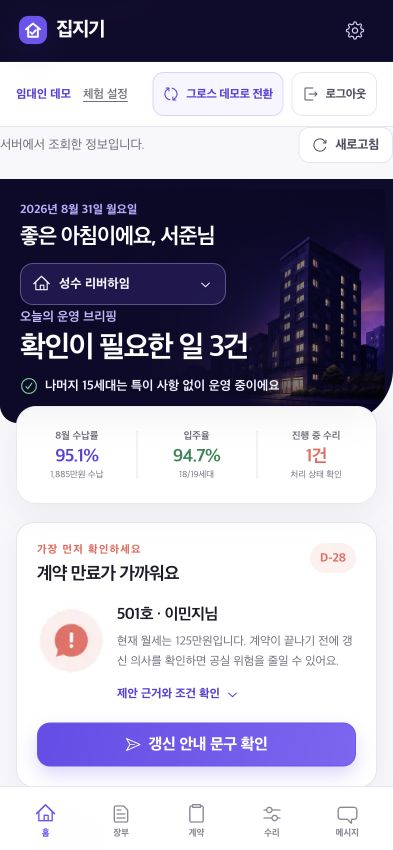
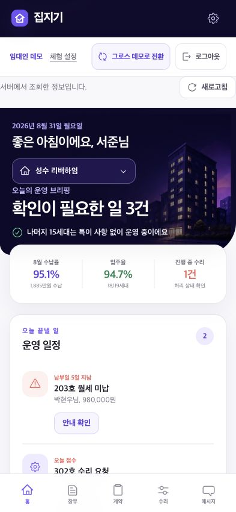
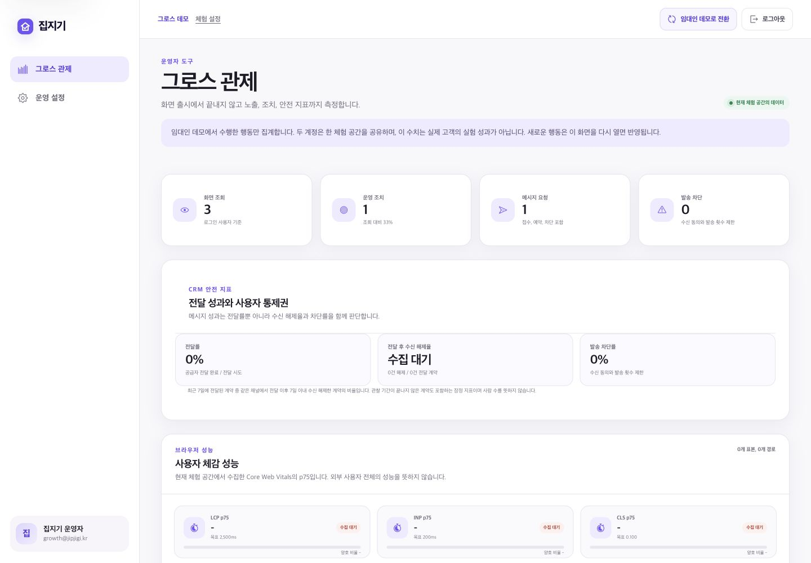

# 집지기 | 임대 운영 그로스 포트폴리오

**곽현 | 프론트엔드 개발자** | [khyun9685@gmail.com](mailto:khyun9685@gmail.com) | [github.com/kwakhyun](https://github.com/kwakhyun)

집지기는 1~20개 호실을 직접 관리하는 임대인이 오늘 처리할 일을 놓치지 않도록 돕는 모바일 중심 임대 운영 서비스입니다. 계약 만료, 월세 수납, 민원 대응을 한곳에 모으고 행동 로그와 A/B 테스트까지 함께 설계했습니다.

임대 관리 도메인의 핵심 문제를 바탕으로 브랜드, 정보 구조, 문구와 화면을 독립적으로 설계했습니다. 제품 문제 정의와 UI/UX 방향 결정부터 React와 Next.js 구현, 데이터 저장, 실험 관제, 테스트와 배포 검증까지 수행했습니다.

| 구분 | 내용 |
| --- | --- |
| 진행 시점 | 2026년 8월 |
| 프로젝트 형태 | Vercel에 공개 배포한 포트폴리오 데모 |
| 핵심 기술 | Next.js 16, React 19, TypeScript, TanStack Query, Jotai, Neon Postgres, Upstash Redis |
| 구현 범위 | 데모 로그인과 역할 권한, 임대 운영 데이터, CRM 안전장치, A/B 테스트와 행동 로그, 관제, CI와 배포 |

**바로 확인하기:** [라이브 데모](https://jipjigi-khyun.vercel.app), [GitHub 저장소](https://github.com/kwakhyun/jipjigi), [GitHub Actions](https://github.com/kwakhyun/jipjigi/actions/workflows/ci.yml)

## 데모 계정

| 역할 | 이메일 | 비밀번호 | 확인할 수 있는 경험 |
| --- | --- | --- | --- |
| 임대인 | `demo@jipjigi.kr` | `demo1234!` | 오늘의 브리핑, 임대 장부, 계약과 수리, 메시지 접수 |
| 그로스 운영자 | `growth@jipjigi.kr` | `demo1234!` | 실험 현황, 행동 로그, CRM 가드레일과 성능 관제 |

첫 로그인 때 브라우저별 체험 공간을 만들고 두 역할의 데이터를 그 안에서 공유합니다. 다른 방문자의 조치는 섞이지 않으며 체험 공간은 생성 후 최대 12시간 유지됩니다.

### 3분 체험 순서

1. **임대인 데모**로 로그인해 만료 28일 전인 501호, 미납 203호와 수리 요청 302호를 확인합니다.
2. **계약 관리 → 갱신 안내 확인 → 발송 조건 확인** 순서로 진행한 뒤 요청을 접수합니다. 새로고침 후에도 메시지와 계약의 연락 기록이 유지됩니다. 실제 알림톡은 발송하지 않습니다.
3. **그로스 데모로 전환**해 같은 체험 공간에서 발생한 메시지 요청과 행동 로그를 확인합니다. 빈 지표는 가짜 수치 대신 수집 대기로 표시합니다.

체험 설정에서 홈 구성을 바꾸거나 본인의 공간만 초기화해 두 실험안을 다시 확인할 수 있습니다.

<!-- pagebreak -->

## 제품 화면

| 계약 만료 먼저 보기 | 오늘 일정 먼저 보기 |
| --- | --- |
|  |  |

두 홈 구성은 같은 데이터에서 정보 우선순위만 다르게 배치한 실험안입니다. 위험 우선안은 계약 갱신을, 일정 우선안은 미납과 수리 일정을 먼저 보여줍니다.

<!-- pagebreak -->

<!-- crop-image: ../.design-qa/portfolio-readiness/growth-desktop.png | 280,195,1130,520 | 핵심 지표 확대: 화면 조회, 운영 조치, 메시지 요청과 CRM 안전 지표 -->

그로스 관제는 화면 조회와 실제 조치, 메시지 요청, 발송 차단, Core Web Vitals를 함께 보여줍니다. 실제 사용자 데이터가 없는 지표는 성과 수치로 채우지 않고 수집 대기로 표시합니다.

## 해결하려는 문제

소규모 임대인은 계약, 입금, 민원을 서로 다른 메신저와 문서에서 관리하는 경우가 많습니다. 그 결과 중요한 후속 조치를 기억에 의존해 처리하게 되고, 어떤 안내가 실제 행동으로 이어졌는지 측정하기도 어렵습니다.

집지기는 홈에서 우선순위와 근거를 함께 보여주고, 확인과 연락, 상태 변경을 하나의 흐름으로 연결합니다. 계약 갱신과 미납 안내, 수리 요청은 서버에 저장되고 이후 상태와 수납 지표에 반영됩니다.

<!-- pagebreak -->

## 핵심 설계 판단

### 실제 노출을 기준으로 실험을 해석했습니다

사용자가 실험군에 배정됐더라도 화면을 보지 않았다면 전환율의 분모에 포함하지 않습니다. 사용자 ID를 안정적으로 해시해 실험안을 고정하고 브리핑 UI가 렌더된 뒤 세션당 한 번만 노출 이벤트를 기록했습니다. 실험안은 서버 배정값으로 확정하고, 관제는 노출 후 24시간 안에 발생한 같은 실험안의 조치만 집계합니다.

**대표 근거:** [실험 배정과 테스트](https://github.com/kwakhyun/jipjigi/blob/main/packages/experiments/src/index.ts), [실험 설계](https://github.com/kwakhyun/jipjigi/blob/main/docs/EXPERIMENTS.md)

### 서버 데이터와 UI 상태의 소유권을 분리했습니다

초기 데이터는 Server Component에서 읽고 `HydrationBoundary`로 클라이언트 캐시에 전달합니다. TanStack Query는 브리핑, 계약, 장부, 수리와 메시지 조회를 맡습니다. `useMutation`으로 변경을 처리한 뒤 관련 캐시를 무효화해 서버의 저장 결과를 다시 읽습니다. 선택 건물은 Jotai, 검색어와 필터, 작성 중인 설정은 로컬 상태로 유지했습니다.

**대표 근거:** [Query 적용 결정과 검증](https://github.com/kwakhyun/jipjigi/blob/main/docs/QUERY-STATE.md)

### CRM 요청은 발송보다 운영 안전성을 먼저 확인했습니다

서버에서 리소스 소유권, 수신 동의 여부와 발송 제한 시간을 다시 확인하고 목적에 맞는 멱등 키를 만듭니다. 갱신 요청은 계약별 24시간 1회와 최근 7일 2회로 제한하고 미납 안내는 계약과 청구월별 한 번만 접수합니다. 전달 결과와 수신 해제, 갱신 응답은 HMAC 웹훅을 거쳐 타임라인과 관제에 반영합니다.

**대표 근거:** [발송 가드레일](https://github.com/kwakhyun/jipjigi/blob/main/apps/web/lib/messaging/guardrails.ts), [CRM 통합 테스트](https://github.com/kwakhyun/jipjigi/blob/main/apps/web/app/api/webhooks/messages/route.test.ts)

### 평가자가 같은 문제 상황을 반복해서 확인할 수 있게 했습니다

공개 로그인과 실제 작업 계정을 분리하고 한국 날짜를 기준으로 새 시나리오를 만듭니다. 초기화는 본인 공간에만 적용하고 새 ID를 발급해 Query 캐시와 실험 기록이 이전 체험에 섞이지 않게 했습니다. 로그인, 역할 전환, 데이터 소유권, 영속 저장과 관제를 하나의 실제 Next.js E2E 여정으로 검증했습니다.

**대표 근거:** [데모 재현성 개선 사례](https://github.com/kwakhyun/jipjigi/blob/main/docs/case-studies/demo-reproducibility.md)

<!-- pagebreak -->

## 기술 구성

| 영역 | 기술 |
| --- | --- |
| 프론트엔드 | Next.js 16, React 19, TypeScript, TanStack Query, Jotai |
| 서버 | Next.js Route Handler, Server Action, Server Component, Zod |
| 데이터 | Neon Postgres, 로컬 PGlite, Upstash Redis |
| 모노레포 | pnpm workspace, Turborepo |
| 테스트 | Vitest, Testing Library, axe-core, Playwright |
| 운영 | GitHub Actions, Vercel, 구조화 로그, Core Web Vitals |

웹 앱과 API를 한 Next.js 프로젝트에서 운영하는 모듈형 모놀리스 구조입니다. 초기 제품의 배포 속도와 타입 공유를 우선하되 도메인, 분석, 실험과 UI를 워크스페이스 패키지로 분리했습니다.

## 품질 검증

| 대상 | 검증 결과 |
| --- | --- |
| 웹 단위 및 통합 | 31개 파일, 126개 테스트와 공통 패키지 테스트 8개 통과 |
| 실제 웹앱 E2E | 저장 유지, 역할 전환, 방문자 격리, 두 홈 구성과 모바일 로그아웃을 포함한 Chromium 핵심 여정 4개 통과 |
| 타입과 빌드 | 5개 패키지 타입 검사와 Next.js 프로덕션 빌드 통과 |
| 성능 예산 | 10개 경로 통과. 실측값 / 예산: 홈 177.3KiB / 185KiB, 메시지 168.0KiB / 170KiB |
| 접근성과 관측 | 주요 흐름에 axe-core 검사 적용. 실제 브라우저 지표를 수집하고 최근 7일 p75 집계 |
| 지속적 통합 | 웹앱과 프로토타입을 독립 작업으로 검증하고 웹앱 E2E를 CI에 포함 |

검증 수치는 2026년 8월 31일 기준입니다. 최신 상태는 [GitHub Actions](https://github.com/kwakhyun/jipjigi/actions/workflows/ci.yml)에서 확인할 수 있습니다.

## 운영 전환 경계

| 현재 공개 데모 | 실서비스 전환에 필요한 작업 |
| --- | --- |
| Vercel 공개 배포, Neon Postgres 영속 저장, Upstash Redis 요청 제한, 샌드박스 알림 공급자, 데모 금융 정보 | 재시도와 복구가 가능한 이벤트 큐와 예약 발송 워커, 실제 인증 체계 구축과 CRM 공급자 연동, 중앙화된 비밀정보 관리와 장애 알림 |

현재 결과물은 프로덕션 구조와 배포 흐름을 검증한 공개 포트폴리오 데모입니다. 실제 사용자 데이터가 없으므로 지표를 성과로 표기하지 않았고 실험을 설계하고 측정 가능한 상태로 구현하는 데 초점을 맞췄습니다.

실제 임대인 사용성 관찰과 A/B 실험 결과 분석은 아직 없습니다. 관찰 과제와 기록 기준, 중단 조건은 [사용자 검증 계획](https://github.com/kwakhyun/jipjigi/blob/main/docs/USER-VALIDATION.md)에 정리했습니다.

AI를 시안 탐색과 구현 보조, 반복 검토에 활용했습니다. 제품 정책과 최종 검증은 별도 기준으로 관리했으며 범위와 한계는 [AI 작업 기록](https://github.com/kwakhyun/jipjigi/blob/main/docs/AI-WORKFLOW.md)에 공개했습니다.

**추가 확인:** [프로덕션 준비 상태](https://github.com/kwakhyun/jipjigi/blob/main/docs/PRODUCTION-READINESS.md), [현재 및 목표 아키텍처](https://github.com/kwakhyun/jipjigi/blob/main/docs/ARCHITECTURE.md), [제품 요구사항](https://github.com/kwakhyun/jipjigi/blob/main/docs/PRD.md)
